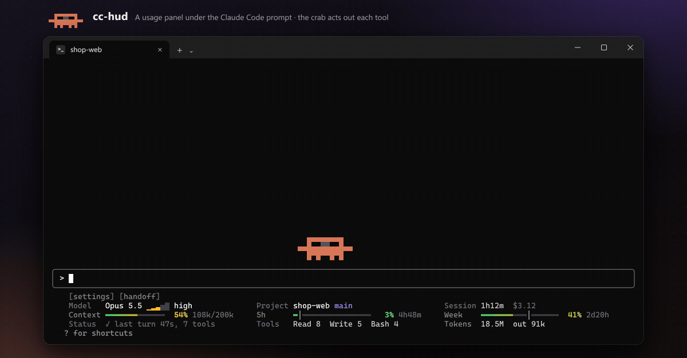
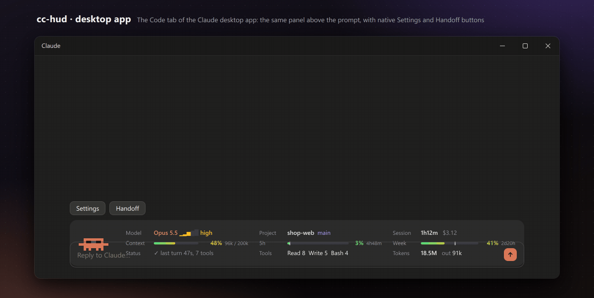

<div align="center">

# cc-hud

English | [简体中文](README.zh-CN.md)

**See your Claude Code usage at a glance, hand off long sessions in one click, and keep a pixel crab company**

[](LICENSE)




</div>

## What is this

**cc-hud** is a [Claude Code mod](https://code.claude.com/docs/en/plugins/mods/overview). A mod is a plugin that can change what Claude Code itself draws. Install it once, and every Claude Code session (in the terminal and in the desktop app) gets:

- **A usage panel under the prompt.** It shows:
  - model and effort, project and git branch, session time and cost
  - context, 5-hour and weekly quota bars, with a time tick and an "out in 40m" warning when you're burning quota too fast
  - what Claude is doing right now, your most-used tools, and total tokens
- **One-click handoff prompts.** When a session gets long, click `[handoff]`: Claude writes a self-contained prompt for continuing in a fresh session, and the mod copies it to your clipboard and saves it to a file. At 85% context the button turns orange to remind you.
- **A subagent board.** It shows every running subagent, workflow agents included, and what each one is doing right now (`Bash npm test`, `Read src/app.ts`, …), grouped by workflow.
- **A pixel crab.** It walks above the prompt and acts out what Claude is doing: reading, typing, running commands, browsing. Your subagents walk behind it as baby crabs. It sweats or panics as your quota runs low, and celebrates when a turn is done. It moves in half-cell steps at 13 frames a second, with in-between poses, so it looks smooth even in a terminal.
- **English and Chinese UI**, switchable from the toolbar or with `/hud lang`.

## Quick start

**1. Install** (run in your terminal)

```bash
claude plugin install cc-hud --marketplace kimyong6366/cc-hud
```

This one command adds the plugin marketplace and installs the mod.

**2. Open a new `claude` session.** The panel appears under the prompt and the crab above it.

**3. Run `/tui fullscreen` once** so you can click the panel. Claude Code saves this setting.

## How to use

You don't have to do anything: the panel and the crab update on their own while you work. When you want something, click it (fullscreen only: on the default renderer the toolbar shows `clicks need /tui fullscreen`) or type the command, which works everywhere:

| You want to | Click (fullscreen) | Or type |
|---|---|---|
| Continue in a fresh session (long session, context filling up) | `[handoff]` on the toolbar, then paste into a new session | `/hud handoff` |
| See what your subagents and workflow agents are doing | `+N agents` in the Status cell | `/hud agents` |
| Switch language | `[settings]` → `Lang` | `/hud lang en`, `/hud lang zh`, `/hud lang auto` |
| Hide or show the crab | `[settings]` → `Crab` | `/hud crab off`, `/hud crab on` |
| Make the panel smaller or hide it | `[settings]` → `Panel` (the one-line panel keeps `[settings] [handoff]` at the front, so you can switch back) | `/hud full`, `/hud compact`, `/hud hide`, or `/hud` to cycle |
| Compact the conversation | `compact` in the Context cell (shows up at 75%) | `/compact` |
| Change model or effort | the model name or the effort word | `/model`, `/effort` |
| See the quota details | the 5h or Week label | `/usage` |

Handoff prompts are saved under `~/.claude/handoffs/<project>/`, outside your repo, so a lost clipboard never loses one.

<details>
<summary>Want to change the code? Load the folder directly</summary>

Clone the repository, then put the absolute path of the `cc-hud` folder in the `env` block of `~/.claude/settings.json`. A mod loaded this way reloads in terminal sessions as soon as you save a file.

```json
{
  "env": {
    "CLAUDE_CODE_PLUGIN_DIRS": "/path/to/cc-hud/cc-hud"
  }
}
```

To try them once without changing any settings:

```bash
claude --plugin-dir ./cc-hud/cc-hud
```

</details>

**Updating:** run `/plugin marketplace update cc-hud` inside Claude Code, or turn on auto-update for this marketplace under `/plugin` → Marketplaces.

**See what a mod does before you install it:** a mod runs with your permissions. Clone the repository and run `claude plugin validate ./cc-hud`; the `hooks:` and `calls:` lines list the events it handles and what it calls.

## cc-hud: an animated usage panel

In the terminal, cc-hud draws two things: a usage panel under the prompt, and a pixel crab that walks in a strip above it.

The panel starts with a small toolbar, `[settings] [handoff]`, followed by a 3 × 3 grid whose labels line up in columns:

| | Column 1 | Column 2 | Column 3 |
|---|---|---|---|
| Row 1 | Model + effort level | Project + git branch | Session time + cost |
| Row 2 | Context usage | 5-hour usage | Weekly usage |
| Row 3 | Status | Most-used tools | Total tokens + output (out) |

The 5-hour and weekly bars each carry a bright `│` tick that marks how much of the window has passed, and a short countdown to the reset follows the bar, such as `1h54m`. When the colored part runs past the tick, you are using quota faster than the clock.

**The crab above the prompt** (terminal only) lives in a strip right above the input box: one blank row that keeps it apart from the conversation, then three rows of crab. It follows what Claude is doing:

| Claude is | The crab |
|---|---|
| Thinking or replying | Walks sideways, eyes on where it's going; thinking dots rise while it thinks |
| Reading or searching | Stops and reads a page while a scan line moves |
| Writing or editing a file | Stops and taps with its right claw as the page fills with text |
| Running a command | Stops and types with both claws, terminal cursor blinking |
| On the web | Stops beside a spinning globe |
| Running subagents | Each running subagent, workflow agents included, adds a baby crab to the line; when it finishes, its crab waves and leaves. The status cell says how many ("+3 agents") |
| Done with a turn | Hops twice with claws up, really leaving the ground, then keeps its claws up; gold sparkles |
| Idle / idle for 5 minutes | Strolls a few steps now and then, blinks and looks around / sleeps, blowing bubbles |
| You type / you send | Stops and looks down at the input box / crouches, jumps up into the blank row above, lands with a squash and a puff of dust |
| At ≥ 80% context | Fades to red over about a second and sweats; at ≥ 95% pulses red smoothly |

The strip draws 13 frames a second (75 ms each), and the crabs walk half a cell at a time: each crab pixel is half a character wide, drawn with quarter-block characters (`▘▝▖▗▌▐…`), so walking looks twice as smooth as the text grid allows. When the big crab stops (to use a tool, to rest), it finishes its half step onto a whole cell so the props beside it stay crisp. Its legs move with its steps.

Every move has in-between frames:

- Claws pass through a half-raised pose when tapping, typing, waving or greeting you.
- Blinks go half-closed first.
- Walking eases in when it starts and eases out at the end of a stroll.
- At either end of the strip the crab pauses with its eyes already turned before walking back.
- Sleep breathing is slow and even.
- A finished subagent waves through a neutral pose and hops out along a little arc.

**The crab also has moods that follow your quota pace** (pace = actual usage ÷ the usage expected for the time elapsed):

| Quota | The crab | The panel |
|---|---|---|
| Using less than the clock (pace < 0.8) | Wears sunglasses, strolls | Normal |
| Clearly ahead of pace, on track to run out before the reset | Sweats, walks faster | The percentage and the countdown turn red: `out 40m` |
| Runs out within 30 minutes, or ≥ 95% used | Panics: flails its claws in turn and flings sweat off its head, with a red "!" flashing beside it; scurries when walking | Same as above |

- Small particles keep it lively: dust behind its feet, a drop of sweat when it hurries, gold sparkles when a turn finishes, bubbles while it sleeps.
- Speech bubbles appear beside the crab for a few seconds: a finished turn (「Done 3m12s」), a finished compaction (「Compacted」), a quota reset (「Quota's back」), a red pace warning (「Slow down! out in 40m」), context filling up (「Context almost full」, then 「Handoff?」 at 85%), and a permission prompt waiting for you (「Your call」).
- In fullscreen mode (`/tui fullscreen`), point at the crab: it stops, waves, and holds a bubble with your usage and a tip until you move away. Point elsewhere on the strip and its eyes follow the pointer. No click needed; a click moves the keyboard focus to the strip, and Esc gives it back.
- The row between the strip and the input box belongs to Claude Code itself (notices such as "copied 4 chars to clipboard" appear there), so the strip can't sit any lower.
- The engine draws `[-]` at the strip's right end: click it or press ctrl+x ctrl+a to fold the strip away. `/hud crab off` turns it off for good. In a short terminal the strip drops its blank row first, then shrinks to two rows, one row, or hides.

**Settings toolbar**: click `[settings]` and the options open on the same row (they wrap onto a second row in narrower windows). Click `[settings]` again to close them. Each choice is remembered across sessions.

```
 [settings] [handoff]   Lang [EN] 中文   Crab [on] off   Panel [full] compact hide
```

- **Lang**: English or Chinese, for the whole panel, crab bubbles, toasts and the subagent board. Until you pick one, it follows Claude Code's `language` setting (Chinese if that's Chinese, English otherwise).
- **Crab**: the walking crab above the prompt.
- **Panel**: full grid, one-line compact, or hidden. The one-line layout has no room for the toolbar, and hiding the panel hides it too; `/hud` brings the full panel back.
- Clicking needs fullscreen rendering (`/tui fullscreen`). On the default (main-screen) renderer the terminal keeps mouse clicks for itself, so the toolbar shows a dim hint, `clicks need /tui fullscreen, or type /hud handoff`, and the `/hud` commands do the same jobs.

**Handoff prompts**: click `[handoff]` (or run `/hud handoff`) when you want to continue in a fresh session. Claude writes a self-contained handoff prompt using the whole conversation, so the next session can pick up where you left off:

- It's written in a side request ("fork") that sees the full conversation but adds nothing to your transcript and reuses the prompt cache. It costs one short reply, which shows up in the session cost.
- While Claude writes, the chip reads `[writing handoff... 8s]`. When it's done, the prompt is **copied to your clipboard** and **saved** to `~/.claude/handoffs/<project>/<YYYY-MM-DD-HHmm>.md`, outside your repo, so a lost clipboard never loses it. A toast tells you where.
- The prompt starts with a header (project, branch, time, and `claude --resume <id>` to reopen the original session), then the sections Goal, Current state, Key decisions, Files & locations, Gotchas, Next steps and Verify. Claude writes it in the language you've been using.
- At 85% context the `[handoff]` brackets turn orange and the crab asks 「Handoff?」 once. It asks again after the context drops below 70%, for example after a compaction.
- Then open a new session (`/clear`, or a new terminal) and paste.

**More practical touches**

- **Turn receipt**: the line that ends each turn gets a tail such as `· $0.42 · 2 files changed +5 -1 · 3 tool calls` (terminal only).
- **One-click compact**: at 75% context a "compact" button appears in the context cell and runs `/compact`.
- **Quota-reset reminder**: after the 5-hour or weekly quota passed 30% and then resets, a toast says it's back.
- **Subagent board**: `/hud agents`, or click "+N agents" in the status cell, opens a side pane. It shows how long each subagent has run, how long since it last did something, and what it's doing right now: the tool plus its main argument, such as `Bash npm test`, `Read src/app.ts` or `Grep "TODO" src` (project paths are shown relative). Anything silent for over 5 minutes is flagged red as possibly stuck.
  - **Workflows**: agents started by a workflow are listed too, grouped under the workflow's name (`── review-changes · 3 running · 2 done ──`), with any other subagents in their own group below. They count toward "+N agents" and walk as baby crabs.
  - When a workflow starts, the board opens by itself, once per run. Claude Code only seats a pane nobody asked for in a terminal at least 144 columns wide; in a narrower one nothing pops up, and "+N agents" still opens it.

Clickable parts: model name → `/model`, effort level → `/effort`, project name → opens the project folder, context → `/context`, 5-hour / weekly → `/usage`, token → a breakdown, "+N agents" → the subagent board.

The panel shrinks with the window: 81 columns or more shows the full 3 × 3 grid, 51–80 columns (such as macOS's default 80) a 3 × 2 grid, and under 51 columns a single line without the toolbar. In the terminal the panel always stays under the prompt.

| Command | What it does |
|---|---|
| `/hud` | Cycles full → compact (one line) → hidden |
| `/hud agents` | Opens the subagent board; Esc closes it |
| `/hud crab`, `/hud crab on`, `/hud crab off` | Toggles the crab above the prompt (on by default) |
| `/hud lang en`, `/hud lang zh`, `/hud lang auto` | Sets the UI language; `auto` follows Claude Code's `language` setting. `/hud lang` alone switches between the two |
| `/hud handoff` | Writes a handoff prompt, copies it and saves it (same as the `[handoff]` chip) |

In the desktop app, the panel becomes a dedicated SVG card (crab + dashboard) above the prompt, borderless, following the light or dark theme. The desktop crab animates smoothly too:
- moves glide instead of stepping a pixel at a time
- claws pass through a half-raised pose, and blinks go half-closed first
- a finished turn makes it really hop twice, and a sent message makes it jump
- red fades in over a second, and pulses smoothly at 95%

**Buttons in the desktop app.** Above the card sit the app's own native buttons:
- **Settings** opens three dropdowns: Lang, Crab and Panel.
- **Handoff** writes a handoff prompt. It turns into the app's primary button once context reaches 85%, and shows "Writing handoff…" while Claude writes.
- The desktop app can't copy to the clipboard from a mod yet, so the handoff is saved to a file and an **Open handoff file** button opens it in your default editor.

Clicks work in the desktop app without any extra setting.

To see every move without the desktop app, run `node tools/preview-client.mjs` and open `tools/out/client.html` in a browser.



- "Cost" is the API list-price equivalent, the same figure `/cost` shows. Subscribers aren't charged this amount.
- Tokens come from the session transcript, subagents included. Cache reads count too, so the number is usually large.

## Requirements

| Item | Notes |
|---|---|
| Claude Code | Terminal 2.1.287 or later, desktop app 2.1.286 or later (the official requirement for mods). Tested on 2.1.289 (Windows) and 2.1.290 (WSL) |
| OS | **Windows**: tested on Windows 11 + Windows Terminal. **Linux**: plugin tests and the open commands verified in WSL (Ubuntu 22.04). **macOS**: covered by mocked tests only; issues are welcome |
| Opening files | Windows: `explorer.exe` / `cmd start`; macOS: `open`; Linux: `xdg-open`, then `gio open`; in WSL, Windows' default apps first (`wslview`, else `explorer.exe` via `wslpath`) |
| Rendering | Clicking and hovering need fullscreen rendering (`/tui fullscreen`) |
| Dependencies | Node.js on your PATH (cc-hud counts tokens with a small script), git (for the branch); on Linux outside WSL, xdg-utils to open files |

- In the macOS desktop app, Node.js installed with Homebrew or nvm may not be on the app's PATH. The token cell then falls back to counting from this launch only; everything else works.
- If you set `CLAUDE_CONFIG_DIR`, cc-hud looks for session transcripts there.

## Uninstall

Removing the marketplace also uninstalls the mod you installed from it:

```bash
claude plugin marketplace remove cc-hud
```

If you loaded the folder directly, remove its path from `CLAUDE_CODE_PLUGIN_DIRS` and restart claude.

## Development

Check and test a mod:

```bash
claude plugin validate ./cc-hud
```

```bash
claude plugin test ./cc-hud
```

- Terminal sessions watch the mod folders and reload on save. Desktop app sessions don't; run `/reload-plugins` there.
- Bump `version` in `plugin.json` after each change: cc-hud reloads itself in the desktop app when the version changes, and marketplace users only receive a new version.
- All UI text lives in `cc-hud/hooks/strings.ts`, one table per language with identical keys (a test checks this). Add a string to both tables.
- In the terminal, use only ASCII, CJK characters, `│ ─ ━ ✓` and block characters. Glyphs such as `• ⏱ ↻ ✦` have an ambiguous width in some terminals and overlap their neighbours.
- `node tools/preview-client.mjs` renders a preview of the desktop panel, plus a gallery of every crab move, to `tools/out/client.html` without opening the app (Node 22.6 or later).
- `tools/demo/` renders the GIFs on this page from the real code, in English and Chinese (see `tools/demo/README.md`).

```
cc-hud/
  hooks/register.tsx        terminal panel, toolbar, handoff and events
  hooks/strings.ts          UI text, English and Chinese
  hooks/desktop.ts          desktop panel (SVG)
  scripts/count-tokens.js   counts a session's tokens, subagents included
tools/                      preview and GIF scripts
assets/                     GIFs for this README
```

## License

[MIT](LICENSE) © 2026 kimyong6366
