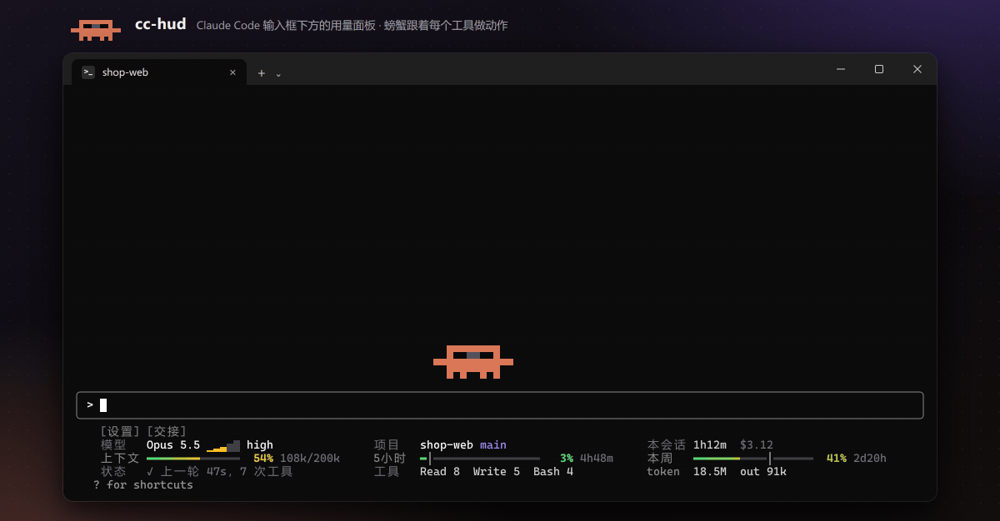
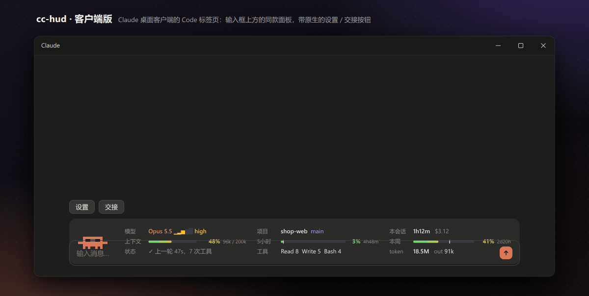

<div align="center">

# cc-hud

[English](README.md) | 简体中文

**一眼看清 Claude Code 的用量，一键交接长会话，还有一只像素螃蟹陪你干活**

[](LICENSE)




</div>

## 这是什么

**cc-hud** 是一个 [Claude Code mod](https://code.claude.com/docs/zh-CN/plugins/mods/overview)。mod 是能改 Claude Code 自己界面的插件。装一次，之后每个 Claude Code 会话（终端和桌面客户端）都会多出这些：

- **输入框下方的用量面板**，显示：
  - 模型和思考档位、项目和 git 分支、会话时长和花费
  - 上下文、5 小时、本周三根额度条，带时间刻度；用得太快时提醒「40m用完」
  - Claude 现在在做什么、最常用的工具、token 总数
- **一键交接提示词**：会话太长时点 `[交接]`，Claude 会写一份自成一体的交接提示词，方便在新会话里接着干；mod 会把它复制到剪贴板并存成文件。上下文到 85% 时按钮变橙色提醒你。
- **子代理看板**：列出每个在跑的子代理（包括 workflow 的代理）和它现在在做什么（`Bash npm test`、`Read src/app.ts` …），按 workflow 分组。
- **一只像素螃蟹**：在输入框上方走来走去，跟着 Claude 的动作演：看文件、敲键盘、跑命令、上网。子代理是跟在后面的小螃蟹。额度紧张时会冒汗、慌张，一轮做完会庆祝。它半格一步、每秒 13 帧，动作有中间帧，在终端里也很顺。
- **中英文界面**，在工具栏或用 `/hud lang` 切换。

## 快速开始

**1. 安装**（在你的终端里运行）

```bash
claude plugin install cc-hud --marketplace kimyong6366/cc-hud
```

这一条命令会先添加插件市场，再安装 mod。

**2. 开一个新的 `claude` 会话。** 输入框下方出现面板，上方出现螃蟹。

**3. 运行一次 `/tui fullscreen`**，面板就能点了。Claude Code 会记住这个设置。

## 怎么用

平时什么都不用做，面板和螃蟹会跟着你干活自己更新。需要的时候，可以直接点（只在全屏画面下有效，默认画面下工具栏会提示「点击需要 /tui fullscreen」），也可以输入命令（任何画面下都能用）：

| 想做什么 | 点哪里（全屏） | 或者输入 |
|---|---|---|
| 换一个新会话接着干（会话太长、上下文快满了） | 工具栏的 `[交接]`，然后在新会话里粘贴 | `/hud handoff` |
| 看子代理和 workflow 的代理在做什么 | 状态格里的「+N代理」 | `/hud agents` |
| 切换语言 | `[设置]` → 语言 | `/hud lang en`、`/hud lang zh`、`/hud lang auto` |
| 开关螃蟹 | `[设置]` → 螃蟹 | `/hud crab off`、`/hud crab on` |
| 让面板变小或藏起来 | `[设置]` → 面板（一行版最前面也有 `[设置] [交接]`，随时能切回来） | `/hud full`、`/hud compact`、`/hud hide`（或 `/hud 完整`、`/hud 精简`、`/hud 隐藏`）；只输 `/hud` 是循环切换 |
| 压缩对话 | 上下文格里的「压缩」（75% 时出现） | `/compact` |
| 换模型或思考档位 | 模型名或档位文字 | `/model`、`/effort` |
| 看额度明细 | 「5小时」或「本周」标签 | `/usage` |

交接提示词存在 `~/.claude/handoffs/<项目>/`，不在你的仓库里；剪贴板丢了也找得回来。

<details>
<summary>想改代码？用本地文件夹加载</summary>

克隆仓库后，把 `cc-hud` 文件夹的绝对路径写进 `~/.claude/settings.json` 的 `env`。这样加载的 mod 在终端会话里一保存就重载。

```json
{
  "env": {
    "CLAUDE_CODE_PLUGIN_DIRS": "C:\\path\\to\\cc-hud\\cc-hud"
  }
}
```

只想试一次、不改设置：

```bash
claude --plugin-dir ./cc-hud/cc-hud
```

</details>

**更新**：在 Claude Code 里运行 `/plugin marketplace update cc-hud`。也可以在 `/plugin` → Marketplaces 里给这个市场打开自动更新。

**装之前想先看它做什么**：mod 以你的权限运行。克隆仓库后运行 `claude plugin validate ./cc-hud`，输出的 `hooks:` 和 `calls:` 两行列出它挂了哪些事件、调用了什么。

## cc-hud：会动的用量面板

在终端里，cc-hud 画两样东西：输入框下方的用量面板，和输入框上方一条横栏里来回走的像素螃蟹。

面板最上面是一行小工具栏 `[设置] [交接]`，下面是一个 3 行 × 3 列的网格，每列标签上下对齐：

| | 第 1 列 | 第 2 列 | 第 3 列 |
|---|---|---|---|
| 第 1 行 | 模型 + 思考档位 | 项目 + git 分支 | 本会话时长 + 花费 |
| 第 2 行 | 上下文用量 | 5 小时用量 | 本周用量 |
| 第 3 行 | 状态 | 用得最多的工具 | token 总数 + 输出（out） |

5 小时和本周的用量条上各有一道亮色竖线 `│`，表示这个窗口的时间过去了多少；条后面是到重置的短倒计时，比如 `1h54m`。彩色段越过竖线，说明额度用得比时间快。

**输入框上方的螃蟹**（只在终端）住在输入框正上方的一条横栏里：最上面空一行，把它和对话正文隔开，下面 3 行是螃蟹。它跟着 Claude 干活：

| Claude 在做 | 螃蟹在做 |
|---|---|
| 思考、回复 | 横着走，眼睛看着前进的方向；思考时头顶往上冒点点 |
| 读文件、搜索 | 停下来看一页纸，扫描线上下移动 |
| 写文件、改文件 | 停下来用右钳敲，纸上慢慢写满字 |
| 跑命令 | 停下来双钳交替敲键盘，终端光标闪烁 |
| 上网 | 停在一个旋转的小地球旁边 |
| 子代理在跑 | 每个在跑的子代理（包括 workflow 的代理）带来一只小螃蟹，排在队里一起走；做完的那只挥挥钳子离场。有几个子代理，看状态格的「+N代理」 |
| 一轮结束 | 举着钳子真的连跳两下（离开地面），之后一直举着钳子；金色闪光 |
| 闲置 / 5 分钟没动 | 隔一会儿溜达几步、眨眼、东张西望 / 闭眼睡觉冒泡泡 |
| 你打字 / 你发出消息 | 停下来低头看输入框 / 先蹲下蓄力，真的跳进上面那行空白，落地时身体压扁、冒一团尘土 |
| 上下文 ≥ 80% | 大约 1 秒内慢慢变红并冒汗；≥ 95% 平滑地一明一暗（像呼吸） |

横栏每秒画 13 帧（75 毫秒一帧），螃蟹走路半格一步：螃蟹的一个像素只占半个字符宽，用四分之一方块字符（`▘▝▖▗▌▐…`）画出来，所以走起来比按字符一格一格挪顺一倍。大螃蟹停下来（用工具、趴着）时会把那半步走完，落在整格上，旁边的道具画得清楚；它的腿跟着步子换。

每个动作都有中间帧：

- 敲钳子、敲键盘、挥手和跟你打招呼时，钳子都会经过「半举」。
- 眨眼先半闭。
- 起步慢慢加速，溜达快结束时慢慢减速。
- 走到横栏一头会先停一下、眼睛先转过去，再往回走。
- 睡觉时呼吸又慢又匀。
- 做完的子代理挥手时左右钳子之间有过渡，离场时沿一条小弧线跳出去。

**螃蟹还有情绪，跟着额度的消耗速度走**（配速 = 实际用量 ÷ 按时间该用的量）：

| 额度情况 | 螃蟹 | 面板 |
|---|---|---|
| 用得比时间慢（配速 < 0.8） | 戴墨镜，慢慢溜达 | 正常 |
| 明显偏快，按这个速度会在重置前用完 | 冒汗，走得更快 | 百分比和倒计时变红，写成「40m用完」 |
| 30 分钟内就会用完，或已用 ≥ 95% | 慌张：两只钳子轮流挥，汗珠从头顶两侧甩出去，旁边红色「!」在闪；走路时小跑 | 同上 |

- 一些小粒子让它更生动：脚后扬起的尘土、小跑时甩出的汗珠、一轮结束时的金色闪光、睡着时冒的泡泡。
- 关键时刻在螃蟹旁边冒气泡，几秒后消失：一轮结束「搞定 3m12s」、压缩完成、额度刷新、超速时红色的「慢点！40m用完」、等你批准权限时「等你点头」。

**设置栏**：点 `[设置]`，选项在同一行展开（窗口窄时换到第二行），再点一次 `[设置]` 收起。选过的会记住，下次会话照样生效。

```
 [设置] [交接]   语言 EN [中文]   螃蟹 [开] 关   面板 [完整] 精简 隐藏
```

- **语言**：英文或中文，面板、气泡、提示和子代理看板都跟着换。没选过时跟随 Claude Code 的 `language` 设置（是中文就中文，否则英文）。
- **螃蟹**：输入框上方散步的螃蟹。
- **面板**：完整、一行精简、隐藏。精简版放不下工具栏，隐藏后工具栏也一起藏起来；输入 `/hud` 恢复。
- 点击需要全屏画面（`/tui fullscreen`）。默认画面下终端自己处理鼠标点击，Claude Code 收不到，所以工具栏旁边会显示一行暗色提示「点击需要 /tui fullscreen，也可以输入 /hud handoff」；`/hud` 的命令能做同样的事。

**交接提示词**：点 `[交接]`（或输入 `/hud handoff`），Claude 会根据整个会话写一份自成一体的交接提示词，方便在新会话里接着干：

- 用分叉请求写：看得到整个对话，但不进对话记录、走提示缓存，只多花一小段回复的钱（算在本会话花费里）。
- 写的时候按钮显示 `[正在写交接 8s]`；写好后**复制到剪贴板**，并**存到** `~/.claude/handoffs/<项目>/<日期-时分>.md`（不在仓库里，剪贴板丢了也不怕），弹 toast 告诉你位置。
- 开头是固定的标题（项目、分支、时间，以及回到原会话的 `claude --resume <id>`），后面是目标、现状、关键决定、文件、坑、下一步、验证几节，用你在对话里用的语言写。
- 上下文到 85% 时 `[交接]` 的方括号变橙色，螃蟹问一次「要交接吗？」；上下文掉到 70% 以下（比如压缩之后）再问。
- 然后开一个新会话（`/clear` 或新终端），粘贴即可。
- 全屏模式（`/tui fullscreen`）下，鼠标停在大螃蟹上：它停下来举钳打招呼，旁边的气泡显示用量和一条小贴士，鼠标移开才接着走。鼠标停在横栏别处时，它的眼睛会看向鼠标。不用点；点一下会把键盘焦点移到横栏，按 Esc 回到输入框。
- 横栏和输入框之间那一行是 Claude Code 自己的通知行（「copied 4 chars to clipboard」这类提示出现在那里），所以横栏没法再往下贴。
- 引擎会在横栏右端画一个 `[-]`：点它或按 ctrl+x ctrl+a 收起；`/hud crab off` 彻底关掉。终端太矮时，先去掉最上面的空行，再缩成 2 行、1 行，或先不画。

**更多实用的小功能**

- **每轮收据**：每轮结束那行后面多一段，比如 `· $0.42 · 改 2 个文件 +5 -1 · 工具 3 次`（只在终端）。
- **一键压缩**：上下文到 75% 时，「上下文」那格出现「压缩」按钮，点一下运行 `/compact`。
- **额度恢复提醒**：5 小时或本周额度用到 30% 以上、之后重置了，弹一次提示「额度已恢复，可以继续了」。
- **子代理看板**：`/hud agents` 或点状态格里的「+N代理」，打开侧边面板。看每个子代理跑了多久、多久没动静、现在在做什么（工具加主要参数，比如 `Bash npm test`、`Read src/app.ts`、`Grep "TODO" src`，项目里的路径写相对路径）；超过 5 分钟没动静的标红「可能卡住」。
  - **Workflow**：workflow 起的代理也会列出来，按 workflow 的名字分组（`── review-changes · 3 个在跑 · 2 个完成 ──`），其他子代理单独一组放在后面。它们也算进「+N代理」，散步道里也有它们的小螃蟹。
  - workflow 开始时看板会自动打开，每次运行只开一次。Claude Code 规定没人点就弹出的面板要终端 ≥144 列才放得下；窄的时候不弹，点「+N代理」照样能打开。

面板上可以点：模型名 → `/model`，思考档位 → `/effort`，项目名 → 打开项目文件夹，上下文 → `/context`，5 小时 / 本周 → `/usage`，token → 明细，「+N代理」→ 子代理看板。

窗口窄的时候面板会自动收缩：81 列以上是完整的 3 行 × 3 列，51–80 列（比如 macOS 默认的 80 列）是 3 行 × 2 列，不到 51 列只显示一行。终端里面板固定在输入框下方。

| 命令 | 作用 |
|---|---|
| `/hud` | 完整 → 精简（一行）→ 隐藏，循环切换 |
| `/hud agents` | 打开子代理看板，Esc 关闭 |
| `/hud crab`、`/hud crab on`、`/hud crab off` | 开关输入框上方的螃蟹（默认开） |
| `/hud lang en`、`/hud lang zh`、`/hud lang auto` | 切换界面语言；auto 跟随 Claude Code 的 `language` 设置。只写 `/hud lang` 就在中英文之间切换 |
| `/hud handoff` | 写一份交接提示词，复制到剪贴板并存成文件（和工具栏的 `[交接]` 一样） |

在桌面客户端里，面板换成一张专用的 SVG 卡片（螃蟹 + 仪表盘），放在输入框上方，无边框，跟随浅色 / 深色主题。桌面版的螃蟹动作也很顺：
- 移动是平滑滑动，不是一格一格跳
- 钳子会经过半举，眨眼先半闭
- 一轮做完真的连跳两下，发出消息跳一下
- 变红时 1 秒内渐变，到 95% 时平滑地一明一暗

**客户端里的按钮**：卡片上方是客户端自己的原生按钮：
- **设置**：展开语言、螃蟹、面板三个下拉框。
- **交接**：写交接提示词。上下文到 85% 时变成客户端的主按钮，写的时候显示「正在写交接…」。
- 客户端目前还不能让 mod 复制到剪贴板，所以交接提示词会存成文件，旁边多一个 **打开交接文件** 按钮，用默认编辑器打开全文。

在客户端里点击不需要额外设置。

不开客户端也能看全部动作：运行 `node tools/preview-client.mjs`，再用浏览器打开 `tools/out/client.html`。



- 「花费」是按 API 标价折算的等价金额，和 `/cost` 同一口径。订阅用户不会真的被扣这笔钱。
- token 数来自会话记录（含子代理），读缓存也算在内，所以数字通常很大。

## 环境要求

| 项目 | 说明 |
|---|---|
| Claude Code | 终端版 2.1.287 及以上，桌面客户端 2.1.286 及以上（官方对 mods 的要求）。在 2.1.289（Windows）和 2.1.290（WSL）上测试 |
| 系统 | **Windows**：Windows 11 + Windows Terminal 真机测试。**Linux**：在 WSL（Ubuntu 22.04）里实测过插件测试和打开文件 / 文件夹的命令。**macOS**：只做了模拟测试，遇到问题欢迎提 issue |
| 打开方式 | Windows 用 `explorer.exe` / `cmd start`；macOS 用 `open`；Linux 用 `xdg-open`，不行再试 `gio open`；WSL 里优先交给 Windows 的默认程序（`wslview`，没有就经 `wslpath` 交给 `explorer.exe`） |
| 渲染 | 点击、悬停需要全屏渲染（`/tui fullscreen`） |
| 依赖 | Node.js（cc-hud 用一个小脚本统计 token，要能在 PATH 里找到）、git（显示分支）；Linux（非 WSL）打开文件要有 xdg-utils |

- macOS 的桌面客户端里，如果 Node.js 是用 Homebrew 或 nvm 装的，客户端可能找不到它。这时 token 一栏会退回只显示「本次启动」以来的数，其他不受影响。
- 设置了 `CLAUDE_CONFIG_DIR` 的话，cc-hud 会到那个目录下找会话记录。

## 卸载

移除插件市场，会连同装过的 mod 一起卸载：

```bash
claude plugin marketplace remove cc-hud
```

用本地文件夹加载的，从 `CLAUDE_CODE_PLUGIN_DIRS` 里删掉对应路径，重新打开 claude 即可。

## 开发

检查和测试一个 mod：

```bash
claude plugin validate ./cc-hud
```

```bash
claude plugin test ./cc-hud
```

- 终端会话会监视 mod 文件夹，保存即重载。桌面客户端会话不会，要运行 `/reload-plugins`。
- 改完把 `plugin.json` 的 `version` 升一级：cc-hud 在客户端里发现版本变了，会自己重载一次。
- 终端里只用 ASCII、中文、`│ ─ ━ ✓` 和方块字符。`• ⏱ ↻ ✦` 这类字符在有些终端里宽度不定，会和旁边的字重叠。
- `node tools/preview-client.mjs`：不开客户端，直接生成客户端面板的预览页 `tools/out/client.html`，里面还有螃蟹每个动作的样张（Node 22.6 及以上）。
- `tools/demo/` 用真代码生成本页的动图，中英文各一套（见 `tools/demo/README.md`）。

```
cc-hud/
  hooks/register.tsx        终端面板、工具栏、交接和各种事件
  hooks/strings.ts          界面文字（英文 / 中文）
  hooks/desktop.ts          客户端面板（SVG）
  scripts/count-tokens.js   统计一个会话用掉的 token（含子代理）
tools/                      预览和动图脚本
assets/                     README 用的动图
```

## 许可证

[MIT](LICENSE) © 2026 kimyong6366
